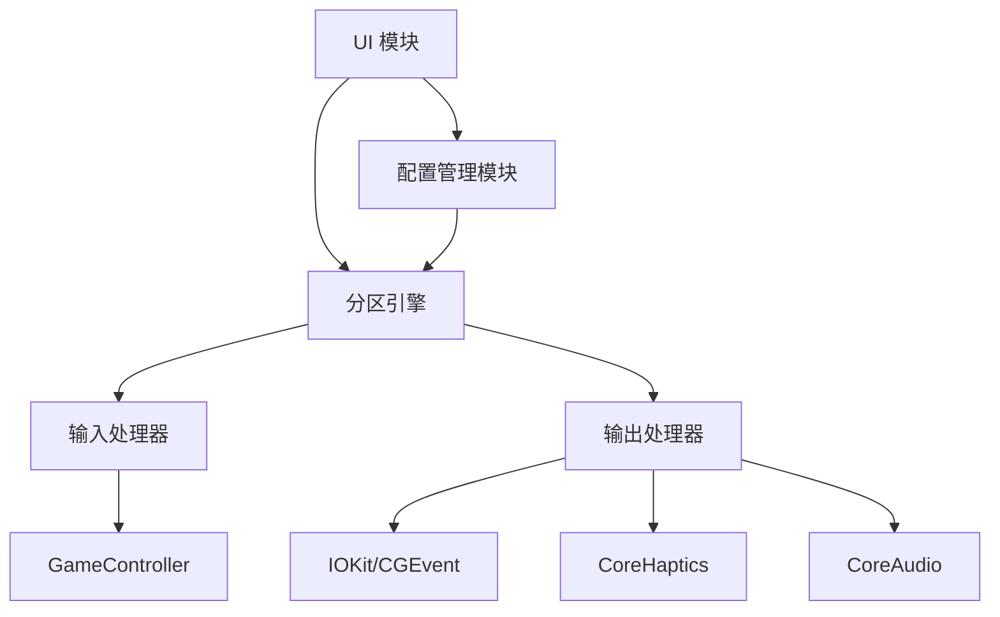

# GamePadToKey - 软件设计文档

**文档版本**：1.0  
**创建日期**：2024-01-16  
**最后更新**：2024-01-16  
**状态**：正式版  
**作者**：GamePadToKey 项目组

---

## 1. 引言

### 1.1 目的
本文档旨在详细描述 GamePadToKey 系统的软件架构设计、模块划分、接口定义以及关键技术实现方案，为开发团队提供统一的 design blueprint。

### 1.2 范围
本文档覆盖 GamePadToKey 的完整软件设计，包括：
- 系统架构设计
- 核心模块详细设计
- 数据流设计
- 接口定义
- 关键技术实现
- 性能设计
- 安全设计

### 1.3 定义和缩写
| 术语 | 定义 |
|------|------|
| DS5 | DualSense 5 手柄 |
| HID | Human Interface Device |
| CGEvent | CoreGraphics 事件 |
| IOKit | I/O Kit 框架 |
| Haptic | 触觉反馈 |
| LED | Light Emitting Diode |

---

## 2. 需求规格描述

### 2.1 功能需求摘要

#### 2.1.1 输入处理需求
| ID | 需求描述 | 优先级 |
|----|---------|--------|
| F001 | 支持 DualSense 手柄的无线（蓝牙）和有线（USB）连接 | P0 |
| F002 | 实时捕获所有手柄输入（按钮、摇杆、触摸板、陀螺仪） | P0 |
| F003 | 输入延迟 < 10ms | P0 |
| F004 | 支持多手柄同时连接和独立配置 | P1 |

#### 2.1.2 映射系统需求
| ID | 需求描述 | 优先级 |
|----|---------|--------|
| M001 | 实现多层级的键盘分区映射系统 | P0 |
| M002 | 支持组合键激活分区（L1+R1+△ 等组合） | P0 |
| M003 | 支持无限层级的分区嵌套 | P1 |
| M004 | 支持分区预览和快速导航 | P2 |

#### 2.1.3 输出模拟需求
| ID | 需求描述 | 优先级 |
|----|---------|--------|
| O001 | 系统级键盘事件模拟（所有应用生效） | P0 |
| O002 | 系统级鼠标事件模拟（移动、点击、滚动） | P0 |
| O003 | 支持修饰键组合（Cmd+C, Ctrl+V 等） | P0 |
| O004 | 多显示器环境下的鼠标精确定位 | P1 |

#### 2.1.4 反馈系统需求
| ID | 需求描述 | 优先级 |
|----|---------|--------|
| H001 | 支持 DualSense 自适应扳机控制 | P0 |
| H002 | 支持 LED 灯带颜色和模式控制 | P0 |
| H003 | 支持触摸板 LED 控制 | P1 |
| H004 | 支持多级振动反馈 | P0 |
| H005 | 支持手柄扬声器音频输出 | P2 |
| H006 | 支持手柄麦克风输入 | P3 |

#### 2.1.5 配置管理需求
| ID | 需求描述 | 优先级 |
|----|---------|--------|
| C001 | 使用 JSON 格式存储配置 | P0 |
| C002 | 支持配置的导入/导出 | P0 |
| C003 | 支持配置的热加载 | P1 |
| C004 | 提供配置验证机制 | P1 |
| C005 | 支持配置版本控制 | P2 |

#### 2.1.6 用户界面需求
| ID | 需求描述 | 优先级 |
|----|---------|--------|
| U001 | 提供菜单栏图标快速访问 | P0 |
| U002 | 提供配置编辑图形界面 | P1 |
| U003 | 提供实时输入预览 | P1 |
| U004 | 提供分区导航预览窗口 | P2 |

### 2.2 非功能需求

#### 2.2.1 性能需求
| ID | 需求描述 | 目标值 |
|----|---------|--------|
| N001 | 输入处理延迟 | < 10ms |
| N002 | CPU 占用率（空闲） | < 1% |
| N003 | CPU 占用率（活动） | < 5% |
| N004 | 内存占用 | < 100MB |
| N005 | 启动时间 | < 3秒 |

#### 2.2.2 可靠性需求
| ID | 需求描述 | 目标值 |
|----|---------|--------|
| R001 | 连续运行稳定性 | 7×24小时 |
| R002 | 断线重连成功率 | > 99% |
| R003 | 崩溃恢复时间 | < 5秒 |

#### 2.2.3 安全需求
| ID | 需求描述 | 实现方式 |
|----|---------|--------|
| S001 | 最小权限原则 | 仅请求必需的系统权限 |
| S002 | 配置数据加密 | 敏感配置 AES-256 加密 |
| S003 | 操作审计 | 记录关键操作日志 |

---

## 3. 系统架构设计

### 3.1 整体架构图

```
┌─────────────────────────────────────────────────────────────────┐
│                        GamePadToKey 应用层                        │
├─────────────────────────────────────────────────────────────────┤
│  ┌─────────────┐  ┌─────────────┐  ┌─────────────┐              │
│  │    UI层     │  │ 配置管理层  │  │  服务层     │              │
│  │ SwiftUI/    │  │ Config      │  │ HotKey      │              │
│  │ AppKit      │  │ Manager     │  │ Service     │              │
│  └─────────────┘  └─────────────┘  └─────────────┘              │
├─────────────────────────────────────────────────────────────────┤
│                         核心业务逻辑层                             │
├─────────────────────────────────────────────────────────────────┤
│  ┌─────────────────────────────────────────────────────────┐   │
│  │                 分区映射引擎 (Partition Engine)          │   │
│  │  ┌──────────┐ ┌──────────┐ ┌──────────┐ ┌──────────┐  │   │
│  │  │分区激活器│ │映射解析器│ │状态管理器│ │上下文感知│  │   │
│  │  └──────────┘ └──────────┘ └──────────┘ └──────────┘  │   │
│  └─────────────────────────────────────────────────────────┘   │
├─────────────────────────────────────────────────────────────────┤
│                       输入/输出处理层                              │
├─────────────────────────────────────────────────────────────────┤
│  ┌────────────────────┐        ┌────────────────────┐          │
│  │   输入处理器        │        │   输出处理器        │          │
│  │ ┌────────────────┐ │        │ ┌────────────────┐ │          │
│  │ │ GameController │ │        │ │ Input Simulator│ │          │
│  │ │ HID Manager    │ │        │ │ CGEvent/IOKit  │ │          │
│  │ └────────────────┘ │        │ └────────────────┘ │          │
│  │ ┌────────────────┐ │        │ ┌────────────────┐ │          │
│  │ │ DS5 专用解码器 │ │        │ │ Feedback       │ │          │
│  │ │ (陀螺仪/触摸板)│ │        │ │ Controller     │ │          │
│  │ └────────────────┘ │        │ └────────────────┘ │          │
│  └────────────────────┘        └────────────────────┘          │
├─────────────────────────────────────────────────────────────────┤
│                         系统接口层                                 │
├─────────────────────────────────────────────────────────────────┤
│  ┌─────────────┐  ┌─────────────┐  ┌─────────────┐              │
│  │  GameCtrl   │  │   IOKit     │  │  CoreHaptics│              │
│  │  Framework  │  │             │  │             │              │
│  └─────────────┘  └─────────────┘  └─────────────┘              │
│  ┌─────────────┐  ┌─────────────┐  ┌─────────────┐              │
│  │  CoreAudio  │  │  CoreBluetooth │  │  Foundation │              │
│  └─────────────┘  └─────────────┘  └─────────────┘              │
└─────────────────────────────────────────────────────────────────┘
```

### 3.2 分层架构描述

#### 3.2.1 系统接口层
- **职责**：与 macOS 系统框架交互
- **主要框架**：GameController.framework, IOKit, CoreHaptics, CoreAudio
- **设计原则**：封装系统调用，提供统一接口

#### 3.2.2 输入/输出处理层
- **职责**：原始数据处理和系统事件模拟
- **核心组件**：
  - 输入处理器：手柄数据采集和解码
  - 输出处理器：键盘鼠标事件模拟
  - 反馈控制器：触觉、视觉、音频反馈控制

#### 3.2.3 核心业务逻辑层
- **职责**：分区映射逻辑实现
- **核心组件**：分区引擎、映射解析器、状态管理器
- **设计原则**：无状态设计，易于测试

#### 3.2.4 应用层
- **职责**：用户交互和配置管理
- **核心组件**：UI界面、配置管理器、服务进程

### 3.3 模块依赖关系



---

## 4. 核心模块详细设计

### 4.1 输入处理模块

#### 4.1.1 模块结构

```swift
// 输入处理器协议
protocol InputProcessor {
    func startCapture() throws
    func stopCapture()
    var delegate: InputProcessorDelegate? { get set }
}

// DualSense 专用处理器
class DualSenseInputProcessor: InputProcessor {
    private var controller: GCController?
    private var dualSense: GCDualSenseGamepad?
    private var motion: GCMotion?
    private let queue = DispatchQueue(label: "com.gamepadtokey.input", qos: .userInteractive)
    
    // 数据缓存
    private var lastButtonState: [String: Bool] = [:]
    private var lastJoystickState: [String: CGPoint] = [:]
    private var lastMotionState: MotionData?
    
    // 配置参数
    private var deadzone: Double = 0.15
    private var motionSensitivity: Double = 1.0
    
    func processInput() {
        // 轮询处理输入（30ms间隔）
        queue.async { [weak self] in
            guard let self = self else { return }
            
            // 处理按钮状态
            self.processButtons()
            
            // 处理摇杆
            self.processJoysticks()
            
            // 处理触摸板
            self.processTouchpad()
            
            // 处理陀螺仪
            self.processMotion()
            
            // 继续下一轮
            DispatchQueue.queue.asyncAfter(deadline: .now() + 0.03) {
                self.processInput()
            }
        }
    }
    
    private func processButtons() {
        guard let gamepad = dualSense else { return }
        
        // 检查所有按钮状态变化
        let buttons: [(String, GCControllerButtonInput)] = [
            ("triangle", gamepad.buttonA),
            ("circle", gamepad.buttonB),
            ("cross", gamepad.buttonX),
            ("square", gamepad.buttonY),
            ("L1", gamepad.leftShoulder),
            ("R1", gamepad.rightShoulder),
            ("L2", gamepad.leftTrigger),
            ("R2", gamepad.rightTrigger),
            ("L3", gamepad.leftThumbstickButton),
            ("R3", gamepad.rightThumbstickButton),
            ("up", gamepad.dpad.up),
            ("down", gamepad.dpad.down),
            ("left", gamepad.dpad.left),
            ("right", gamepad.dpad.right)
        ]
        
        for (name, button) in buttons {
            let currentState = button.isPressed
            if lastButtonState[name] != currentState {
                delegate?.buttonStateChanged(name: name, pressed: currentState)
                lastButtonState[name] = currentState
            }
        }
    }
}

// 输入数据模型
struct InputEvent {
    enum EventType {
        case buttonPress(button: String, pressed: Bool)
        case joystickMove(joystick: JoystickType, position: CGPoint)
        case touchpadTouch(position: CGPoint, touching: Bool)
        case motion(gyro: (x: Double, y: Double, z: Double), 
                   acceleration: (x: Double, y: Double, z: Double))
    }
    
    let type: EventType
    let timestamp: TimeInterval
}
```

#### 4.1.2 数据流

```
手柄硬件 → GameController.framework → DualSenseInputProcessor 
→ 数据标准化 → 输入事件队列 → 分区引擎
```

### 4.2 分区映射引擎

#### 4.2.1 核心数据结构

```swift
// 分区节点
class PartitionNode {
    let id: String
    let name: String
    let type: PartitionType
    let activationCombo: Set<ActivationKey>
    
    // 层级关系
    weak var parent: PartitionNode?
    var children: [PartitionNode] = []
    
    // 映射表
    var mappings: [String: Mapping] = [:]
    
    // 区域定义（在键盘上的位置）
    var bounds: CGRect?
    
    // 反馈配置
    var feedback: PartitionFeedback?
    
    // 查找映射
    func findMapping(for button: String) -> Mapping? {
        return mappings[button]
    }
}

// 激活组合键
struct ActivationCombo: Hashable {
    let requiredButtons: Set<String>  // 必须按住的按钮
    let optionalButtons: Set<String>? // 可选按钮
    let timeout: TimeInterval?        // 激活超时
    
    func matches(pressedButtons: Set<String>) -> Bool {
        return requiredButtons.isSubset(of: pressedButtons)
    }
}

// 映射定义
struct Mapping {
    let button: String
    let action: Action
    let feedback: MappingFeedback?
    
    enum Action {
        case keyPress(key: String, modifiers: [String])
        case keyCombo(keys: [String])
        case mouseMove(sensitivity: Double, acceleration: Bool)
        case mouseClick(button: MouseButton, mode: ClickMode)
        case mouseScroll(axis: ScrollAxis, sensitivity: Double)
        case macro(id: String)
    }
}

// 分区状态机
class PartitionStateMachine {
    private var currentPartition: PartitionNode?
    private var navigationStack: [PartitionNode] = []
    private var activationTimer: Timer?
    
    // 状态枚举
    enum State {
        case idle                     // 空闲状态
        case activating(combo: ActivationCombo) // 激活中
        case inPartition(PartitionNode)         // 在分区中
        case navigating               // 导航中
    }
    
    private var state: State = .idle
    
    // 处理输入
    func handleInput(_ event: InputEvent) {
        switch state {
        case .idle:
            handleIdleState(event)
        case .activating(let combo):
            handleActivatingState(event, combo: combo)
        case .inPartition(let partition):
            handleInPartitionState(event, partition: partition)
        case .navigating:
            handleNavigatingState(event)
        }
    }
    
    private func handleInPartitionState(_ event: InputEvent, partition: PartitionNode) {
        switch event.type {
        case .buttonPress(let button, let pressed):
            if pressed {
                // 检查是否是退出组合
                if isExitCombo(button) {
                    navigateBack()
                    return
                }
                
                // 查找映射
                if let mapping = partition.findMapping(for: button) {
                    executeMapping(mapping)
                }
            }
        default:
            break
        }
    }
}
```

#### 4.2.2 激活算法

```swift
class PartitionActivator {
    private let rootPartition: PartitionNode
    private var activePath: [PartitionNode] = []
    
    // 查找可激活的分区
    func findActivatablePartitions(pressedButtons: Set<String>) -> [PartitionNode] {
        var results: [PartitionNode] = []
        
        // 从当前路径的最后一个分区开始搜索
        let startNode = activePath.last ?? rootPartition
        
        func search(node: PartitionNode) {
            // 检查当前节点是否可激活
            if node.activationCombo.matches(pressedButtons: pressedButtons) {
                results.append(node)
            }
            
            // 搜索子节点
            for child in node.children {
                search(node: child)
            }
        }
        
        search(node: startNode)
        return results
    }
    
    // 激活分区
    func activatePartition(_ partition: PartitionNode) {
        // 构建激活路径
        var path: [PartitionNode] = []
        var current: PartitionNode? = partition
        while let node = current {
            path.insert(node, at: 0)
            current = node.parent
        }
        
        activePath = path
        
        // 发送激活反馈
        sendActivationFeedback(partition)
        
        // 通知状态变更
        NotificationCenter.default.post(
            name: .partitionActivated,
            object: partition
        )
    }
}
```

### 4.3 输出模拟模块

#### 4.3.1 键盘模拟器

```swift
class KeyboardSimulator {
    private let eventSource: CGEventSource?
    
    init() {
        eventSource = CGEventSource(stateID: .combinedSessionState)
    }
    
    // 模拟按键
    func simulateKeyPress(key: String, modifiers: [String] = []) {
        guard let keyCode = KeyCodeMapper.getCode(for: key) else {
            return
        }
        
        let flags = modifiers.reduce(into: CGEventFlags()) { flags, mod in
            if let cgFlag = ModifierMapper.getCGFlag(for: mod) {
                flags.insert(cgFlag)
            }
        }
        
        // 按下
        let keyDownEvent = CGEvent(keyboardEventSource: eventSource,
                                   virtualKey: keyCode,
                                   keyDown: true)
        keyDownEvent?.flags = flags
        keyDownEvent?.post(tap: .cghidEventTap)
        
        // 释放（延迟50ms）
        DispatchQueue.main.asyncAfter(deadline: .now() + 0.05) {
            let keyUpEvent = CGEvent(keyboardEventSource: self.eventSource,
                                     virtualKey: keyCode,
                                     keyDown: false)
            keyUpEvent?.flags = flags
            keyUpEvent?.post(tap: .cghidEventTap)
        }
    }
    
    // 模拟组合键
    func simulateKeyCombo(keys: [String]) {
        guard keys.count >= 2 else {
            if let first = keys.first {
                simulateKeyPress(key: first)
            }
            return
        }
        
        // 按下所有修饰键
        let modifiers = Array(keys.dropLast())
        let mainKey = keys.last!
        
        for mod in modifiers {
            pressModifier(mod)
        }
        
        // 按下主键
        simulateKeyPress(key: mainKey)
        
        // 释放所有修饰键
        DispatchQueue.main.asyncAfter(deadline: .now() + 0.1) {
            for mod in modifiers.reversed() {
                self.releaseModifier(mod)
            }
        }
    }
    
    private func pressModifier(_ modifier: String) {
        guard let keyCode = KeyCodeMapper.getCode(for: modifier) else { return }
        let event = CGEvent(keyboardEventSource: eventSource,
                           virtualKey: keyCode,
                           keyDown: true)
        event?.post(tap: .cghidEventTap)
    }
    
    private func releaseModifier(_ modifier: String) {
        guard let keyCode = KeyCodeMapper.getCode(for: modifier) else { return }
        let event = CGEvent(keyboardEventSource: eventSource,
                           virtualKey: keyCode,
                           keyDown: false)
        event?.post(tap: .cghidEventTap)
    }
}
```

#### 4.3.2 鼠标模拟器

```swift
class MouseSimulator {
    private let eventSource: CGEventSource?
    private var lastMousePosition: CGPoint
    
    init() {
        eventSource = CGEventSource(stateID: .combinedSessionState)
        lastMousePosition = NSEvent.mouseLocation
    }
    
    // 模拟鼠标移动
    func simulateMouseMove(deltaX: CGFloat, deltaY: CGFloat, sensitivity: Double = 1.0) {
        let currentPos = NSEvent.mouseLocation
        let newX = currentPos.x + deltaX * sensitivity
        let newY = currentPos.y - deltaY * sensitivity // 坐标系转换
        
        // 边界检查
        let screenFrame = NSScreen.main?.frame ?? .zero
        let clampedX = min(max(newX, 0), screenFrame.width)
        let clampedY = min(max(newY, 0), screenFrame.height)
        
        let moveEvent = CGEvent(mouseEventSource: eventSource,
                               mouseType: .mouseMoved,
                               mouseCursorPosition: CGPoint(x: clampedX, y: clampedY),
                               mouseButton: .left)
        moveEvent?.post(tap: .cghidEventTap)
        
        lastMousePosition = CGPoint(x: clampedX, y: clampedY)
    }
    
    // 模拟鼠标点击
    func simulateMouseClick(button: CGMouseButton, clickCount: Int = 1) {
        let location = NSEvent.mouseLocation
        
        for i in 0..<clickCount {
            // 按下
            let downType: CGEventType
            let upType: CGEventType
            
            switch button {
            case .left:
                downType = .leftMouseDown
                upType = .leftMouseUp
            case .right:
                downType = .rightMouseDown
                upType = .rightMouseUp
            case .center:
                downType = .otherMouseDown
                upType = .otherMouseUp
            @unknown default:
                return
            }
            
            let downEvent = CGEvent(mouseEventSource: eventSource,
                                   mouseType: downType,
                                   mouseCursorPosition: location,
                                   mouseButton: button)
            downEvent?.post(tap: .cghidEventTap)
            
            // 释放
            DispatchQueue.main.asyncAfter(deadline: .now() + 0.05) {
                let upEvent = CGEvent(mouseEventSource: self.eventSource,
                                     mouseType: upType,
                                     mouseCursorPosition: location,
                                     mouseButton: button)
                upEvent?.post(tap: .cghidEventTap)
            }
            
            // 双击间隔
            if i < clickCount - 1 {
                Thread.sleep(forTimeInterval: 0.1)
            }
        }
    }
    
    // 模拟滚动
    func simulateScroll(deltaY: CGFloat, deltaX: CGFloat = 0) {
        let scrollEvent = CGEvent(scrollWheelEvent2Source: eventSource,
                                 units: .line,
                                 wheelCount: 2,
                                 wheel1: Int32(deltaY),
                                 wheel2: Int32(deltaX),
                                 wheel3: 0)
        scrollEvent?.post(tap: .cghidEventTap)
    }
}
```

### 4.4 反馈控制模块

#### 4.4.1 多通道反馈控制器

```swift
class DualSenseFeedbackController {
    private var dualSense: GCDualSenseGamepad?
    private var hapticEngine: CHHapticEngine?
    
    // LED 控制
    func setLED(color: (r: CGFloat, g: CGFloat, b: CGFloat), 
                pattern: LEDPattern = .solid) {
        guard let dualSense = dualSense else { return }
        
        // DualSense 的 LED 控制
        dualSense.light.colorRed = color.r
        dualSense.light.colorGreen = color.g
        dualSense.light.colorBlue = color.b
        
        // 根据模式设置闪烁
        switch pattern {
        case .solid:
            dualSense.light.flashDuration = 0
            dualSense.light.flashBrightness = 0
        case .pulse:
            // 呼吸效果需要在定时器中动态调整
            startPulseAnimation()
        case .blink(let onDuration, let offDuration):
            startBlinkAnimation(on: onDuration, off: offDuration)
        default:
            break
        }
    }
    
    // 自适应扳机控制
    func setTriggerEffect(mode: TriggerMode, 
                          startPosition: Float = 0,
                          endPosition: Float = 1,
                          strength: Float = 1.0) {
        guard let dualSense = dualSense else { return }
        
        // DualSense 的扳机效果配置
        let leftTrigger = dualSense.leftTrigger
        let rightTrigger = dualSense.rightTrigger
        
        switch mode {
        case .off:
            leftTrigger.setModeOff()
            rightTrigger.setModeOff()
            
        case .resistance:
            leftTrigger.setModeResistance(startPosition: startPosition,
                                         endPosition: endPosition,
                                         strength: strength)
            rightTrigger.setModeResistance(startPosition: startPosition,
                                          endPosition: endPosition,
                                          strength: strength)
            
        case .feedback:
            leftTrigger.setModeFeedback(startPosition: startPosition,
                                       endPosition: endPosition,
                                       strength: strength,
                                       frequency: 100)
            rightTrigger.setModeFeedback(startPosition: startPosition,
                                        endPosition: endPosition,
                                        strength: strength,
                                        frequency: 100)
            
        case .weapon:
            leftTrigger.setModeWeapon(startPosition: startPosition,
                                     endPosition: endPosition,
                                     strength: strength)
            rightTrigger.setModeWeapon(startPosition: startPosition,
                                      endPosition: endPosition,
                                      strength: strength)
            
        case .vibration:
            leftTrigger.setModeVibration(startPosition: startPosition,
                                        endPosition: endPosition,
                                        amplitude: strength,
                                        frequency: 100)
            rightTrigger.setModeVibration(startPosition: startPosition,
                                         endPosition: endPosition,
                                         amplitude: strength,
                                         frequency: 100)
        }
    }
    
    // 振动控制
    func playVibration(intensity: Float, pattern: VibrationPattern) {
        guard let dualSense = dualSense else { return }
        
        // 使用 CoreHaptics 实现精细振动控制
        switch pattern {
        case .constant:
            dualSense.haptics?.playConstant(intensity: intensity)
            
        case .pulse:
            dualSense.haptics?.playPulse(intensity: intensity,
                                         duration: 0.5,
                                         frequency: 5)
            
        case .rampUp:
            dualSense.haptics?.playRamp(from: 0, to: intensity, duration: 1.0)
            
        case .custom(let curve):
            dualSense.haptics?.playCustom(curve: curve)
        }
    }
}
```

### 4.5 配置管理模块

#### 4.5.1 配置加载器

```swift
class ConfigurationManager {
    private var currentConfig: Configuration?
    private let configDirectory: URL
    private let fileManager = FileManager.default
    
    init() {
        let appSupport = fileManager.urls(for: .applicationSupportDirectory,
                                         in: .userDomainMask).first!
        configDirectory = appSupport.appendingPathComponent("GamePadToKey/Configs")
        createConfigDirectoryIfNeeded()
    }
    
    // 加载配置
    func loadConfiguration(named: String) throws -> Configuration {
        let configURL = configDirectory.appendingPathComponent("\(named).json")
        let data = try Data(contentsOf: configURL)
        
        let decoder = JSONDecoder()
        var config = try decoder.decode(Configuration.self, from: data)
        
        // 验证配置
        try validateConfiguration(config)
        
        // 构建分区树
        config.rootPartition = buildPartitionTree(config.partitions)
        
        currentConfig = config
        return config
    }
    
    // 保存配置
    func saveConfiguration(_ config: Configuration) throws {
        let encoder = JSONEncoder()
        encoder.outputFormatting = .prettyPrinted
        
        let data = try encoder.encode(config)
        let configURL = configDirectory
            .appendingPathComponent(config.name)
            .appendingPathExtension("json")
        
        try data.write(to: configURL)
    }
    
    // 验证配置
    private func validateConfiguration(_ config: Configuration) throws {
        // 检查激活组合键冲突
        var combos: Set<Set<String>> = []
        
        func checkPartition(_ partition: Partition) throws {
            let comboSet = Set(partition.activationCombo)
            if combos.contains(comboSet) {
                throw ConfigError.duplicateActivationCombo(partition.name)
            }
            combos.insert(comboSet)
            
            for child in partition.children {
                try checkPartition(child)
            }
        }
        
        for partition in config.partitions {
            try checkPartition(partition)
        }
        
        // 检查映射有效性
        // 检查键盘按键存在性
        // 检查反馈配置有效性
    }
    
    // 构建分区树
    private func buildPartitionTree(_ partitions: [Partition]) -> PartitionNode {
        let root = PartitionNode(id: "root", name: "Root", type: .root)
        
        for partition in partitions {
            let node = buildNode(partition, parent: root)
            root.children.append(node)
        }
        
        return root
    }
    
    private func buildNode(_ partition: Partition, parent: PartitionNode) -> PartitionNode {
        let node = PartitionNode(id: partition.id,
                                name: partition.name,
                                type: partition.type)
        node.parent = parent
        node.activationCombo = Set(partition.activationCombo)
        node.bounds = partition.bounds
        node.feedback = partition.feedback
        
        // 构建映射
        for mapping in partition.mappings {
            node.mappings[mapping.button] = mapping
        }
        
        // 构建子节点
        for child in partition.children {
            let childNode = buildNode(child, parent: node)
            node.children.append(childNode)
        }
        
        return node
    }
}

// 配置数据模型
struct Configuration: Codable {
    let configVersion: String
    let name: String
    let author: String
    let description: String
    let globalSettings: GlobalSettings
    let keyboardLayout: KeyboardLayout
    let partitions: [Partition]
    
    // 运行时构建的树结构
    var rootPartition: PartitionNode?
}

struct Partition: Codable {
    let id: String
    let name: String
    let type: PartitionType
    let activationCombo: [String]
    let bounds: CGRect?
    let feedback: PartitionFeedback?
    let children: [Partition]
    let mappings: [Mapping]
}

struct Mapping: Codable {
    let button: String
    let action: ActionConfig
    let feedback: MappingFeedback?
}
```

---

## 5. 数据流设计

### 5.1 主数据流

```
┌─────────┐   输入事件   ┌─────────┐   原始数据   ┌─────────┐
│ DualSense│───────────>│  输入   │────────────>│  事件   │
│  手柄    │            │ 处理器  │             │  队列   │
└─────────┘             └─────────┘             └─────────┘
                                                       │
                                                       ▼
┌─────────┐   映射执行   ┌─────────┐   分区查找   ┌─────────┐
│  输出   │<───────────│  分区   │<────────────│  事件   │
│ 模拟器  │            │  引擎   │             │ 分发器  │
└─────────┘             └─────────┘             └─────────┘
     │                       │
     ▼                       ▼
┌─────────┐            ┌─────────┐
│ 系统事件 │            │ 反馈控制 │
│ (键盘/鼠标)           │ (振动/LED)│
└─────────┘            └─────────┘
```

### 5.2 事件处理流程

```swift
// 事件处理管道
class EventPipeline {
    private let inputQueue = DispatchQueue(label: "com.gamepadtokey.input", qos: .userInteractive)
    private let processingQueue = DispatchQueue(label: "com.gamepadtokey.processing", qos: .userInitiated)
    private let outputQueue = DispatchQueue(label: "com.gamepadtokey.output", qos: .userInitiated)
    
    func processInput(_ rawInput: RawInput) {
        inputQueue.async { [weak self] in
            // 1. 数据标准化
            let event = self?.normalizeInput(rawInput)
            
            // 2. 事件预处理（去抖、过滤）
            guard let processedEvent = self?.preprocessEvent(event) else {
                return
            }
            
            // 3. 提交到处理队列
            self?.processingQueue.async {
                // 4. 分区查找
                let mapping = self?.partitionEngine.findMapping(for: processedEvent)
                
                // 5. 执行映射
                if let mapping = mapping {
                    self?.executeMapping(mapping, with: processedEvent)
                }
            }
        }
    }
    
    private func executeMapping(_ mapping: Mapping, with event: ProcessedEvent) {
        // 6. 并行执行输出和反馈
        DispatchQueue.concurrentPerform(iterations: 2) { index in
            if index == 0 {
                // 输出模拟
                outputQueue.sync {
                    outputSimulator.execute(mapping.action)
                }
            } else {
                // 反馈控制
                feedbackController.execute(mapping.feedback)
            }
        }
    }
}
```

---

## 6. 接口设计

### 6.1 内部接口

#### 6.1.1 输入处理器接口

```swift
protocol InputProcessorDelegate: AnyObject {
    func buttonStateChanged(name: String, pressed: Bool)
    func joystickMoved(joystick: JoystickType, position: CGPoint)
    func touchpadTouched(position: CGPoint, touching: Bool)
    func motionUpdated(gyro: (x: Double, y: Double, z: Double),
                      acceleration: (x: Double, y: Double, z: Double))
}
```

#### 6.1.2 分区引擎接口

```swift
protocol PartitionEngineProtocol {
    func handleInput(_ event: InputEvent)
    func activatePartition(_ partitionId: String) -> Bool
    func getCurrentPartition() -> PartitionNode?
    func getPartitionPath() -> [PartitionNode]
    func registerObserver(_ observer: PartitionObserver)
}
```

#### 6.1.3 输出模拟器接口

```swift
protocol OutputSimulatorProtocol {
    func simulateKeyPress(key: String, modifiers: [String])
    func simulateKeyCombo(keys: [String])
    func simulateMouseMove(deltaX: CGFloat, deltaY: CGFloat, sensitivity: Double)
    func simulateMouseClick(button: MouseButton, clickCount: Int)
    func simulateMouseScroll(deltaY: CGFloat, deltaX: CGFloat)
}
```

### 6.2 外部接口

#### 6.2.1 系统权限接口

```swift
class PermissionManager {
    enum PermissionType {
        case accessibility
        case inputMonitoring
        case bluetooth
    }
    
    func checkPermission(_ type: PermissionType) -> Bool
    func requestPermission(_ type: PermissionType) async -> Bool
    func openSecurityPreferences()
}
```

#### 6.2.2 配置导入导出接口

```swift
protocol ConfigurationImportExport {
    func exportConfiguration(_ config: Configuration) -> Data
    func importConfiguration(from data: Data) throws -> Configuration
    func shareConfiguration(_ config: Configuration) -> URL
}
```

---

## 7. 关键技术实现

### 7.1 低延迟输入处理

```swift
class HighPerformanceInputProcessor {
    private let inputRing = RingBuffer<RawInput>(size: 1024)
    private let processingThread = Thread()
    
    func start() {
        // 设置线程优先级
        processingThread.qualityOfService = .userInteractive
        processingThread.threadPriority = 1.0
        
        // 使用 CFRunLoop 实现精确定时
        CFRunLoopRun()
    }
    
    // 无锁环形缓冲区
    class RingBuffer<T> {
        private var buffer: [T?]
        private var head = 0
        private var tail = 0
        private let size: Int
        
        func push(_ item: T) -> Bool {
            // 原子操作实现无锁队列
            while true {
                let currentTail = tail
                let nextTail = (currentTail + 1) % size
                
                if nextTail != head {
                    // CAS 操作
                    if atomic_compare_exchange_weak(&tail, currentTail, nextTail) {
                        buffer[currentTail] = item
                        return true
                    }
                } else {
                    return false // 缓冲区满
                }
            }
        }
    }
}
```

### 7.2 高效分区查找

```swift
class PartitionLookupTable {
    private var lookupCache: [String: PartitionNode] = [:]
    private var trieRoot: TrieNode = TrieNode()
    
    // 构建 Trie 树加速查找
    class TrieNode {
        var children: [String: TrieNode] = [:]
        var partition: PartitionNode?
    }
    
    func buildIndex(from root: PartitionNode) {
        // 遍历所有分区，构建查找索引
        func traverse(_ node: PartitionNode, path: [String]) {
            let key = path.sorted().joined(separator: "+")
            lookupCache[key] = node
            
            // 构建 Trie
            var current = trieRoot
            for button in path.sorted() {
                if current.children[button] == nil {
                    current.children[button] = TrieNode()
                }
                current = current.children[button]!
            }
            current.partition = node
            
            for child in node.children {
                traverse(child, path: path + Array(child.activationCombo))
            }
        }
        
        traverse(root, path: [])
    }
    
    func findPartition(for pressedButtons: Set<String>) -> PartitionNode? {
        // 使用 Trie 树快速查找
        var current = trieRoot
        let sortedButtons = pressedButtons.sorted()
        
        for button in sortedButtons {
            if let next = current.children[button] {
                current = next
            } else {
                break
            }
        }
        
        return current.partition
    }
}
```

### 7.3 精确的输入模拟

```swift
class PreciseInputSimulator {
    // 使用 mach 时间实现精确延迟
    private func preciseDelay(microseconds: UInt32) {
        let start = mach_absolute_time()
        var timebase: mach_timebase_info = mach_timebase_info()
        mach_timebase_info(&timebase)
        
        let target = start + UInt64(microseconds) * UInt64(timebase.denom) / UInt64(timebase.numer)
        
        while mach_absolute_time() < target {
            // 忙等待确保精度
            __asm__("pause")
        }
    }
    
    // 模拟按键，支持精确的按下/释放时序
    func simulateKeyWithTiming(key: KeyCode, 
                               pressDuration: TimeInterval,
                               releaseAfter: TimeInterval) {
        // 按下
        let downEvent = CGEvent(keyboardEventSource: nil,
                               virtualKey: key.rawValue,
                               keyDown: true)
        downEvent?.post(tap: .cghidEventTap)
        
        // 精确延迟
        let pressTime = mach_absolute_time()
        
        DispatchQueue.global().asyncAfter(deadline: .now() + pressDuration) {
            // 检查是否应该提前释放
            if mach_absolute_time() - pressTime < UInt64(releaseAfter * 1e9) {
                // 还没到释放时间，继续等待
            } else {
                // 释放按键
                let upEvent = CGEvent(keyboardEventSource: nil,
                                     virtualKey: key.rawValue,
                                     keyDown: false)
                upEvent?.post(tap: .cghidEventTap)
            }
        }
    }
}
```

---

## 8. 性能设计

### 8.1 性能预算分配

| 组件 | 延迟预算 | CPU 预算 | 说明 |
|------|---------|---------|------|
| 输入采集 | 2ms | 0.5% | GameController 回调 |
| 数据预处理 | 1ms | 0.5% | 滤波、去抖 |
| 分区查找 | 2ms | 1% | Trie 树查找 |
| 映射执行 | 2ms | 1% | 动作分发 |
| 输出模拟 | 2ms | 1% | CGEvent 发送 |
| 反馈控制 | 1ms | 0.5% | Haptics/LED |
| **总计** | **10ms** | **4.5%** | 满足设计目标 |

### 8.2 优化策略

#### 8.2.1 编译时优化
- 使用 Swift 的 `@inlinable` 优化高频调用函数
- 值类型替代引用类型减少堆分配
- 使用 `final class` 启用静态派发

#### 8.2.2 运行时优化
- 对象池复用事件对象
- 预计算查找表
- 使用无锁数据结构
- 线程亲和性设置

#### 8.2.3 内存优化
- 环形缓冲区避免动态分配
- 共享缓冲区减少内存拷贝
- 按需加载配置

---

## 9. 安全设计

### 9.1 权限管理

```swift
class SecurityManager {
    enum PermissionStatus {
        case notDetermined
        case granted
        case denied
    }
    
    // 权限检查矩阵
    private let requiredPermissions: [PermissionType: String] = [
        .accessibility: "需要辅助功能权限来模拟键盘输入",
        .inputMonitoring: "需要输入监控权限来读取手柄输入",
        .bluetooth: "需要蓝牙权限连接手柄"
    ]
    
    // 最小权限申请
    func requestMinimalPermissions() async -> Bool {
        var grantedCount = 0
        
        for (permission, _) in requiredPermissions {
            if await requestPermission(permission) {
                grantedCount += 1
            }
        }
        
        return grantedCount == requiredPermissions.count
    }
    
    // 权限降级处理
    func handlePermissionDenied(_ permission: PermissionType) {
        switch permission {
        case .accessibility:
            // 降级为仅支持有限功能
            enableLimitedFunctionality()
        case .inputMonitoring:
            // 显示引导用户开启权限
            showPermissionGuide()
        default:
            break
        }
    }
}
```

### 9.2 数据安全

```swift
class SecureStorage {
    private let keychain = KeychainWrapper()
    
    // 加密存储配置
    func saveSecureConfig(_ config: Configuration, password: String) throws {
        let encoder = JSONEncoder()
        var data = try encoder.encode(config)
        
        // AES-256 加密
        let encryptedData = try AES256.encrypt(data: data, password: password)
        
        // 存储到 Keychain
        try keychain.set(encryptedData, forKey: "secure_config")
    }
    
    // 加载加密配置
    func loadSecureConfig(password: String) throws -> Configuration {
        guard let encryptedData = try keychain.getData(forKey: "secure_config") else {
            throw SecurityError.configNotFound
        }
        
        let decryptedData = try AES256.decrypt(data: encryptedData, password: password)
        
        let decoder = JSONDecoder()
        return try decoder.decode(Configuration.self, from: decryptedData)
    }
}
```

### 9.3 审计日志

```swift
class AuditLogger {
    private let logQueue = DispatchQueue(label: "com.gamepadtokey.audit")
    private let maxLogSize = 10 * 1024 * 1024 // 10MB
    
    enum LogLevel {
        case info
        case warning
        case error
        case security
    }
    
    func log(_ level: LogLevel, _ message: String, file: String = #file, line: Int = #line) {
        logQueue.async {
            let timestamp = ISO8601DateFormatter().string(from: Date())
            let logEntry = "[\(timestamp)] [\(level)] \(message) [\(file):\(line)]\n"
            
            // 写入日志文件
            self.writeToLogFile(logEntry)
            
            // 安全事件特殊处理
            if level == .security {
                self.notifySecurityEvent(logEntry)
            }
            
            // 日志轮转
            self.rotateLogIfNeeded()
        }
    }
    
    private func writeToLogFile(_ entry: String) {
        guard let logURL = getLogFileURL() else { return }
        
        do {
            let fileHandle = try FileHandle(forWritingTo: logURL)
            fileHandle.seekToEndOfFile()
            if let data = entry.data(using: .utf8) {
                fileHandle.write(data)
            }
            fileHandle.closeFile()
        } catch {
            // 创建新日志文件
            try? entry.data(using: .utf8)?.write(to: logURL)
        }
    }
}
```

---

## 10. 部署和配置

### 10.1 目录结构

```
GamePadToKey.app/
├── Contents/
│   ├── MacOS/
│   │   └── GamePadToKey          # 主程序
│   ├── Resources/
│   │   ├── DefaultConfig.json    # 默认配置
│   │   ├── Sounds/                # 音效文件
│   │   └── Help/                  # 帮助文档
│   ├── Frameworks/
│   │   └── Embedded frameworks
│   └── Info.plist
```

### 10.2 配置文件位置

```
~/Library/Application Support/GamePadToKey/
├── Configs/
│   ├── default.json
│   ├── gaming.json
│   └── productivity.json
├── Logs/
│   └── audit.log
├── Cache/
│   └── preview_cache/
└── Preferences/
    └── com.gamepadtokey.plist
```

### 10.3 启动流程

```swift
@main
struct GamePadToKeyApp: App {
    @NSApplicationDelegateAdaptor(AppDelegate.self) var appDelegate
    
    var body: some Scene {
        WindowGroup {
            ContentView()
        }
    }
}

class AppDelegate: NSObject, NSApplicationDelegate {
    private let permissionManager = PermissionManager()
    private let inputProcessor = DualSenseInputProcessor()
    private let partitionEngine = PartitionEngine()
    private let outputSimulator = OutputSimulator()
    private let configManager = ConfigurationManager()
    
    func applicationDidFinishLaunching(_ notification: Notification) {
        // 1. 检查权限
        Task {
            let granted = await permissionManager.requestMinimalPermissions()
            if !granted {
                showPermissionAlert()
            }
        }
        
        // 2. 加载配置
        do {
            let config = try configManager.loadConfiguration(named: "default")
            partitionEngine.loadConfiguration(config)
        } catch {
            loadDefaultConfig()
        }
        
        // 3. 启动输入处理
        inputProcessor.delegate = self
        try? inputProcessor.startCapture()
        
        // 4. 设置菜单栏图标
        setupMenuBar()
        
        // 5. 注册系统事件监听
        registerSystemEventListeners()
    }
    
    func applicationWillTerminate(_ notification: Notification) {
        inputProcessor.stopCapture()
        outputSimulator.cleanup()
    }
}
```

---

## 11. 测试策略

### 11.1 单元测试

```swift
class PartitionEngineTests: XCTestCase {
    func testPartitionActivation() {
        let engine = PartitionEngine()
        let config = loadTestConfig()
        engine.loadConfiguration(config)
        
        // 测试激活组合
        let pressed: Set<String> = ["L1", "R1", "triangle"]
        let partition = engine.findActivatablePartition(pressedButtons: pressed)
        
        XCTAssertNotNil(partition)
        XCTAssertEqual(partition?.id, "letter_zone")
    }
    
    func testMappingLookup() {
        // 测试映射查找性能
        measure {
            for _ in 0..<1000 {
                _ = engine.findMapping(for: randomInput())
            }
        }
    }
}
```

### 11.2 集成测试

```swift
class IntegrationTests: XCTestCase {
    func testEndToEndLatency() {
        // 测量从手柄输入到系统事件的完整延迟
        let expectation = XCTestExpectation()
        
        let startTime = mach_absolute_time()
        
        // 模拟手柄输入
        simulateButtonPress("triangle")
        
        // 监听系统事件
        NSEvent.addGlobalMonitorForEvents(matching: .keyDown) { event in
            let endTime = mach_absolute_time()
            let latency = self.machTimeToMilliseconds(endTime - startTime)
            
            XCTAssertLessThan(latency, 10)
            expectation.fulfill()
        }
        
        wait(for: [expectation], timeout: 1)
    }
}
```

---

## 12. 附录

### 12.1 关键类图

```
┌─────────────────────────────────────────────────────────────────┐
│                        GamePadToKey 核心类图                       │
├─────────────────────────────────────────────────────────────────┤
│                                                                 │
│  ┌──────────────┐       ┌──────────────┐       ┌──────────────┐│
│  │  AppDelegate │──────▶│ Configuration│──────▶│  Partition   ││
│  │              │       │   Manager    │       │    Engine    ││
│  └──────────────┘       └──────────────┘       └──────────────┘│
│         │                       ▲                      ▲        │
│         │                       │                      │        │
│         ▼                       │                      │        │
│  ┌──────────────┐       ┌──────────────┐       ┌──────────────┐│
│  │   DualSense  │──────▶│   Partition  │──────▶│  Partition   ││
│  │   Processor  │       │  StateMachine│       │   Lookup     ││
│  └──────────────┘       └──────────────┘       └──────────────┘│
│         │                                      ▲                │
│         │                                      │                │
│         ▼                                      │                │
│  ┌──────────────┐       ┌──────────────┐       ┌──────────────┐│
│  │   Keyboard   │──────▶│    Mouse     │──────▶│   Feedback   ││
│  │  Simulator   │       │  Simulator   │       │  Controller  ││
│  └──────────────┘       └──────────────┘       └──────────────┘│
│                                                                 │
└─────────────────────────────────────────────────────────────────┘
```

### 12.2 序列图 - 按键处理流程

```
用户                    手柄                    GamePadToKey                系统
 |                       |                           |                       |
 |--按下按钮------------->|                           |                       |
 |                       |--输入事件----------------->|                       |
 |                       |                           |--查找分区------------->|
 |                       |                           |<--返回分区-------------|
 |                       |                           |--查找映射------------->|
 |                       |                           |<--返回映射-------------|
 |                       |                           |                       |
 |                       |                           |--发送反馈-------------|
 |                       |<--振动/LED-----------------|                       |
 |                       |                           |                       |
 |                       |                           |--模拟按键------------->|
 |                       |                           |                       |--接收事件
 |                       |                           |                       |
 |                       |                           |<--事件完成-------------|
 |                       |<--处理完成------------------|                       |
 |<--感受到反馈------------|                           |                       |
```

### 12.3 状态图 - 分区激活

```
        ┌─────────┐
        │   Idle  │
        └────┬────┘
             │ 检测到激活组合
             ▼
        ┌─────────┐
        │Activating│
        └────┬────┘
             │ 组合有效
             ▼
        ┌─────────┐     退出组合    ┌─────────┐
        │InPartition│◀─────────────│Navigating│
        └────┬────┘                └─────────┘
             │ 激活子分区                ▲
             ▼                          │
        ┌─────────┐     返回上级    ┌─────────┐
        │InSubPart│───────────────▶│         │
        └─────────┘                 └─────────┘
```

---

**文档版本**：1.0  
**创建日期**：2024-01-16  
**最后更新**：2024-01-16  
**状态**：正式版  
**审核人**：架构组  
**批准人**：技术总监
